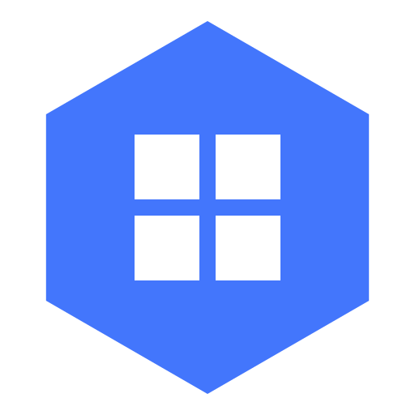
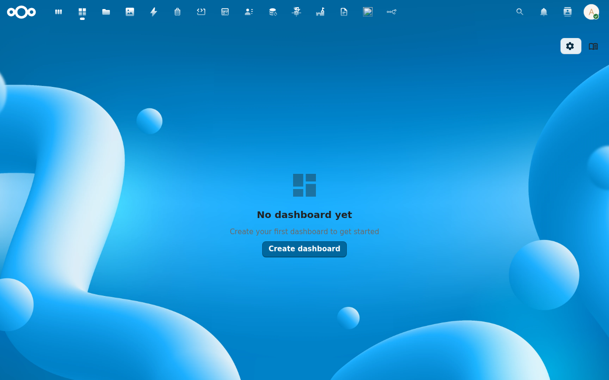
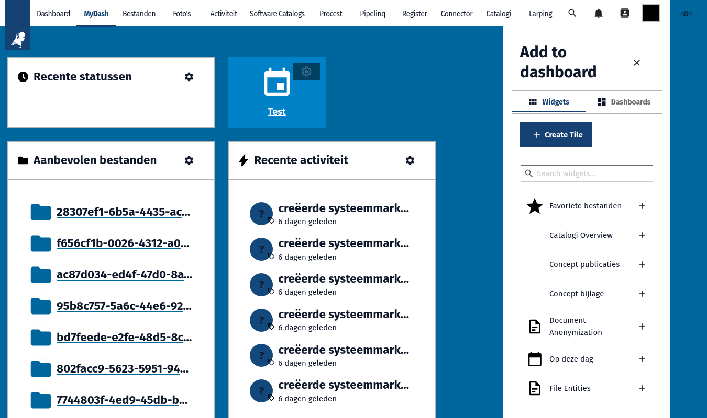
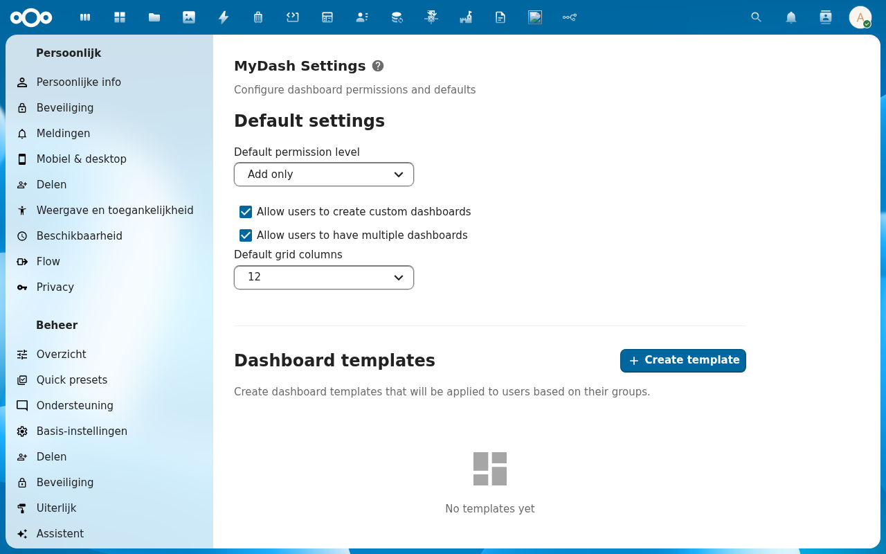
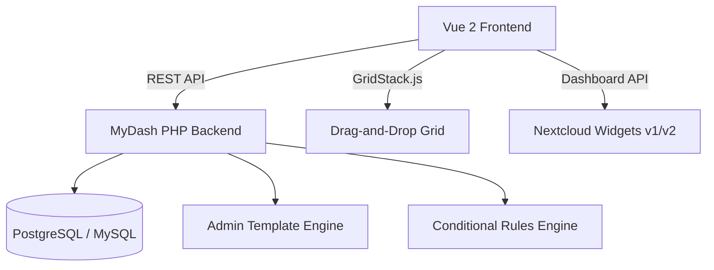

<p align="center">
  
</p>

<h1 align="center">MyDash</h1>

<p align="center">
  <strong>Customizable multi-dashboard for Nextcloud — drag-and-drop widgets, templates, and smart visibility rules</strong>
</p>

<p align="center">
  <a href="https://github.com/ConductionNL/mydash/releases"></a>
  <a href="https://github.com/ConductionNL/mydash/blob/main/LICENSE"></a>
  <a href="https://github.com/ConductionNL/mydash/actions"></a>
  <a href="https://mydash.app"></a>
</p>

---

MyDash supercharges the Nextcloud dashboard. Create multiple personalized workspaces with drag-and-drop widgets, custom shortcut tiles, and smart visibility rules — then let admins roll out templates to entire teams. It works with every existing Nextcloud dashboard widget out of the box, supporting both the v1 and v2 Dashboard APIs.

## Screenshots

<table>
  <tr>
    <td></td>
    <td></td>
    <td></td>
  </tr>
  <tr>
    <td align="center"><em>Dashboard</em></td>
    <td align="center"><em>Widgets</em></td>
    <td align="center"><em>Admin Templates</em></td>
  </tr>
</table>

## Features

### Dashboard Management
- **Multiple Dashboards** — Create as many dashboards as you need and switch between them instantly
- **Drag-and-Drop Grid** — Position and resize widgets freely on a flexible GridStack-powered layout
- **Active Dashboard** — Set any dashboard as your default landing page
- **Dashboard Sharing** — Share dashboards with other users or groups

### Widget System
- **Widget Picker** — Browse and add from all available Nextcloud dashboard widgets (API v1 and v2)
- **Custom Tiles** — Add shortcut cards with icons, colors, and links to your most-used tools
- **Widget Styling** — Customize colors, borders, titles, and padding for each individual widget
- **Compulsory Widgets** — Admins can pin important widgets that users cannot remove

### Templates & Rules
- **Admin Templates** — Pre-configure dashboards and distribute them to user groups with one click
- **Permission Levels** — Choose view-only, add-only, or full customization per template
- **Conditional Visibility** — Show or hide widgets based on group membership, time of day, or date range
- **Default Dashboards** — Assign templates as the default for new users or specific groups

### Integrations
- **Nextcloud Dashboard API** — Full compatibility with v1 and v2 widget APIs
- **NL Design Theming** — Supports design token theming via the [NL Design](https://github.com/ConductionNL/nldesign) app
- **Responsive Layout** — Adapts grid columns and widget sizes to screen width

## Architecture



### Data Model

| Table | Description |
|-------|-------------|
| `oc_mydash_dashboards` | Dashboard configurations and ownership |
| `oc_mydash_widget_placements` | Widget positions, sizes, and styling |
| `oc_mydash_conditional_rules` | Visibility rules (group, time, date) |
| `oc_mydash_admin_settings` | Admin templates and global settings |

### Directory Structure

```
mydash/
├── appinfo/           # Nextcloud app manifest, routes, navigation
├── lib/               # PHP backend — controllers, services, mappers, entities
│   ├── Controller/    # API controllers (dashboard, widget, admin)
│   ├── Service/       # Business logic layer
│   ├── Db/            # Mappers and entities (Doctrine ORM)
│   └── Settings/      # Admin settings panel
├── src/               # Vue 2 frontend — components, Pinia stores, views
│   ├── components/    # Reusable UI components (grid, widgets, tiles)
│   ├── store/         # Pinia stores (dashboards, widgets, settings)
│   └── views/         # Route-level views
├── img/               # App icons and screenshots
├── l10n/              # Translations (en, nl)
└── tests/             # PHPUnit tests
```

## Requirements

| Dependency | Version |
|-----------|---------|
| Nextcloud | 28 -- 33 |
| PHP | 8.1+ |
| PostgreSQL | 12+ |
| MySQL (alternative) | 8.0+ |

## Installation

### From the Nextcloud App Store

1. Go to **Apps** in your Nextcloud instance
2. Search for **MyDash**
3. Click **Download and enable**

### From Source

```bash
cd /var/www/html/custom_apps
git clone https://github.com/ConductionNL/mydash.git
cd mydash
composer install
npm install
npm run build
php occ app:enable mydash
```

## Development

### Start the environment

```bash
docker compose -f openregister/docker-compose.yml up -d
```

### Frontend development

```bash
cd mydash
npm install
npm run dev        # Watch mode
npm run build      # Production build
```

### Code quality

```bash
# PHP
composer phpcs          # Check coding standards
composer cs:fix         # Auto-fix issues
composer phpmd          # Mess detection
composer phpmetrics     # HTML metrics report

# Frontend
npm run lint            # ESLint
npm run stylelint       # CSS linting
```

## Tech Stack

| Layer | Technology |
|-------|-----------|
| Frontend | Vue 2.7, Pinia, @nextcloud/vue |
| Build | Webpack 5, @nextcloud/webpack-vue-config |
| Grid | GridStack.js (drag-and-drop layout engine) |
| Backend | PHP 8.1+, Nextcloud App Framework |
| Data | PostgreSQL 12+ / MySQL 8.0+ (own tables) |
| Quality | PHPCS, PHPMD, phpmetrics, ESLint, Stylelint |

## Documentation

Full documentation is available at **[mydash.app](https://mydash.app)**

| Page | Description |
|------|-------------|
| [GitHub](https://github.com/ConductionNL/mydash) | Source code and issue tracker |
| [Discussions](https://github.com/ConductionNL/mydash/discussions) | Community Q&A and feature requests |

## Standards & Compliance

- **Accessibility:** WCAG AA (Dutch government requirement)
- **Theming:** NL Design System design tokens
- **Dashboard API:** Nextcloud Dashboard API v1 and v2
- **Authorization:** Nextcloud group-based permissions
- **Localization:** English and Dutch

## Related Apps

- **[NL Design](https://github.com/ConductionNL/nldesign)** — Design token theming for consistent look and feel
- **[OpenRegister](https://github.com/ConductionNL/openregister)** — Object storage layer
- **[OpenCatalogi](https://github.com/ConductionNL/opencatalogi)** — Publication and catalog management

## License

AGPL-3.0-or-later

## Authors

Built by [Conduction](https://conduction.nl) -- open-source software for Dutch government and public sector organizations.
