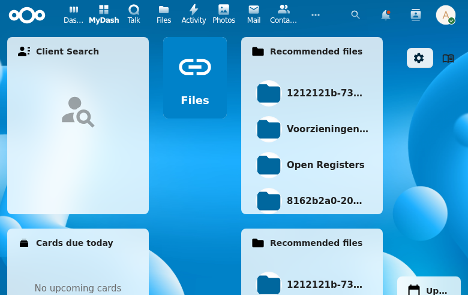

# Admin Settings

Admin settings provide Nextcloud administrators with global configuration options for the MyDash app.

## Settings

| Setting | Type | Default | Description |
|---------|------|---------|-------------|
| allowUserDashboards | boolean | true | Whether non-admin users can create their own dashboards |
| allowMultipleDashboards | boolean | true | Whether users can have more than one dashboard |
| defaultPermissionLevel | string | add_only | Default permission level for user-created dashboards |
| defaultGridColumns | integer | 12 | Default number of grid columns for new dashboards |

## API Endpoints

| Method | Endpoint | Description |
|--------|----------|-------------|
| GET | `/api/admin/settings` | Get all settings |
| PUT | `/api/admin/settings` | Update settings |

## Notes

- Settings stored as JSON-encoded key-value pairs in `oc_mydash_admin_settings`
- DB uses snake_case keys, API returns camelCase keys
- Admin-only access enforced

## Screenshot

