# Widgets

Widgets are the primary content blocks on MyDash dashboards. MyDash combines two widget sources:

- **Nextcloud Dashboard API widgets** — every widget registered by an installed Nextcloud app, exposed via the v1 (`IAPIWidget`) or v2 (`IAPIWidgetV2`) interface, plus the legacy callback-based widgets.
- **Registry-driven custom widgets** — a curated set of 17 in-app widget types defined in [`src/constants/widgetRegistry.js`](../../src/constants/widgetRegistry.js). Each entry pairs a Vue renderer with an Add Widget sub-form and a `defaultContent` shape.

This page documents the **registry-driven** catalog. For app-level Dashboard API widgets, see the host app's documentation.

## Widget catalog

| # | Type | Display name | Icon | Use it for |
|---|---|---|---|---|
| 1 | [`label`](#label) | Label | `FormatTitle` | Short, single-line headings inside a cell |
| 2 | [`text`](#text) | Text | `FormatText` | Multi-line markdown / HTML / table content |
| 3 | [`image`](#image) | Image | `Camera` | A single image (URL or Files-picker) |
| 4 | [`link`](#link) | Link Button | `LinkVariant` | One-click action / external link button |
| 5 | [`nc-widget`](#nc-widget) | Nextcloud Widget | `ViewDashboard` | Proxy for any installed NC Dashboard widget |
| 6 | [`header`](#header) | Header Banner | `ViewHeadline` | Hero banner with overlay + CTA |
| 7 | [`divider`](#divider) | Divider | `Minus` | Visual separator (line / heading / whitespace) |
| 8 | [`files`](#files) | Files | `Folder` | Inline Files browser (folder or file pin) |
| 9 | [`people`](#people) | People | `AccountGroup` | Roster of users with filters & birthdays |
| 10 | [`quicklinks`](#quicklinks) | Quicklinks | `Star` | Tile-grid of favourite links |
| 11 | [`news`](#news) | News | `RssBox` | Aggregated RSS / Atom feeds |
| 12 | [`video`](#video) | Video | `Video` | Embedded video (URL or Files) |
| 13 | [`calendar`](#calendar) | Calendar | `Calendar` | Internal NC calendars + external ICS |
| 14 | [`links`](#links) | Links | `LinkBoxVariant` | Sectioned link directory |
| 15 | [`menu`](#menu) | Menu | `ViewDashboard` | Dropdown / horizontal navigation menu |
| 16 | [`container`](#container) | Container | `ViewDashboard` | Recursive sub-grid host (max depth 3) |
| 17 | [`tile`](#tile) | Tile | `ViewGrid` | Single icon-tile shortcut |

## How widgets are persisted

Every placement is one row in `oc_mydash_widget_placements`:

| Column | Stores |
|---|---|
| `widget_id` | The registry type key (e.g. `label`) — or a Nextcloud Dashboard widget id |
| `grid_x` / `grid_y` / `grid_width` / `grid_height` | GridStack position |
| `style_config` | Optional per-placement style overrides (JSON) |
| `content` | Per-type configuration blob (JSON) — shape matches the type's `defaultContent` |
| `custom_title` / `custom_icon` | Per-placement title/icon overrides |
| `tile_*` | Legacy columns used by the standalone tile flow |

The `content` column was added in [`Version001025Date20260508060000`](../../lib/Migration/Version001025Date20260508060000.php) to make the registry-driven types persistable end-to-end.

## REST API

| Method | Endpoint | Description |
|---|---|---|
| `GET` | `/api/widgets` | List Nextcloud Dashboard API widgets visible to the user |
| `GET` | `/api/widgets/items` | Fetch items for one or more widgets |
| `POST` | `/api/dashboard/{dashboardId}/widgets` | Add a placement (accepts `widgetId`, grid coords, optional `content`) |
| `PUT` | `/api/widgets/{placementId}` | Update grid / style / content of a placement |
| `DELETE` | `/api/widgets/{placementId}` | Remove a placement |

## Known polish items

- The wrapper still draws a "Widget" header above chrome-less types (`label`, `divider`, `header`). The data and rendering are correct; the title row is just visual noise on those three. Tracked as a follow-up.
- The Add button can stay disabled when the widget type is freshly switched in the modal until the user touches a sub-form input — the `validationTick` watcher in `AddWidgetModal.vue` only bumps on `update:content` events, not on `type` changes. Workaround: edit any field once after switching type.

---

## label

A short, single-line plain-text heading inside a dashboard cell. Content is rendered via Vue interpolation only (never `v-html`), so any HTML inside `text` is shown as literal characters — XSS-safe by construction.

**Renderer**: [`LabelWidget.vue`](../../src/components/Widgets/Renderers/LabelWidget.vue) · **Form**: [`LabelForm.vue`](../../src/components/Widgets/Forms/LabelForm.vue) · **Spec**: `openspec/specs/label-widget/spec.md`

| Field | Default | Notes |
|---|---|---|
| `text` | `''` | Heading text. Empty → renderer falls back to "Label". |
| `fontSize` | `16px` | Any CSS length. |
| `color` | `var(--color-main-text)` | Empty = inherit theme. |
| `backgroundColor` | `transparent` | Cell background. |
| `fontWeight` | `bold` | `normal` / `bold`. |
| `textAlign` | `center` | `left` / `center` / `right`. |

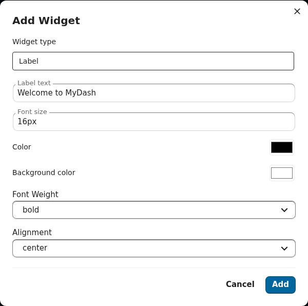
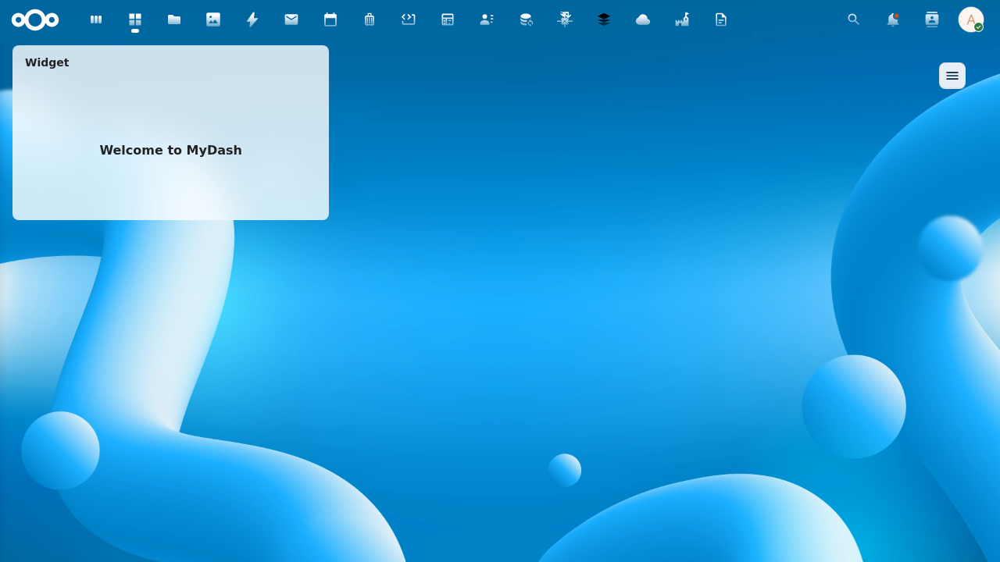

---

## text

Multi-line text block with markdown / HTML / table rendering modes. New placements default to `markdown`; rows that pre-date `contentMode` fall through to the legacy HTML branch.

**Renderer**: [`TextDisplayWidget.vue`](../../src/components/Widgets/Renderers/TextDisplayWidget.vue) · **Form**: [`TextDisplayForm.vue`](../../src/components/Widgets/Forms/TextDisplayForm.vue) · **Spec**: `openspec/specs/text-display-widget/spec.md`

| Field | Default | Notes |
|---|---|---|
| `text` | `''` | Body. Markdown when `contentMode='markdown'`. |
| `fontSize` | `14px` | |
| `color` / `backgroundColor` | `''` / `''` | |
| `textAlign` | `left` | |
| `contentMode` | `markdown` | `markdown` / `html`. |
| `tableMode` / `tableData` | `false` / `null` | Switches the renderer to a structured table. |

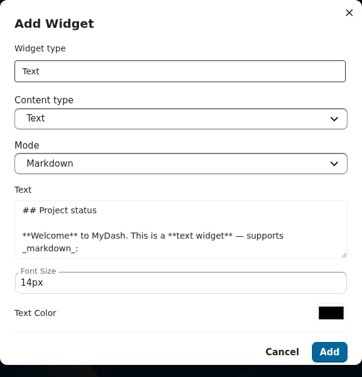
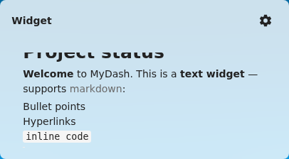

---

## image

A single image with three sources: external URL, uploaded file, or a Files-picker pin.

**Renderer**: [`ImageWidget.vue`](../../src/components/Widgets/Renderers/ImageWidget.vue) · **Form**: [`ImageForm.vue`](../../src/components/Widgets/Forms/ImageForm.vue) · **Spec**: `openspec/specs/image-widget/spec.md`

| Field | Default | Notes |
|---|---|---|
| `url` | `''` | External URL or Files path. |
| `alt` | `''` | Accessible alt text. |
| `link` | `''` | Optional click-through URL. |
| `fit` | `cover` | `cover` / `contain` / `fill` / `none`. |

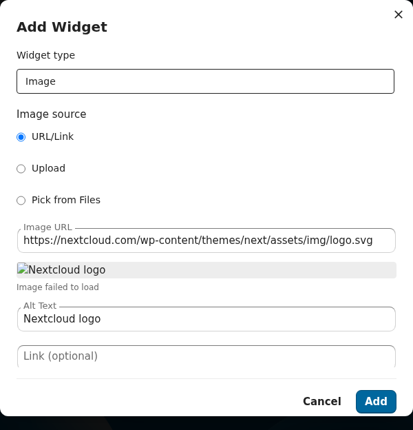
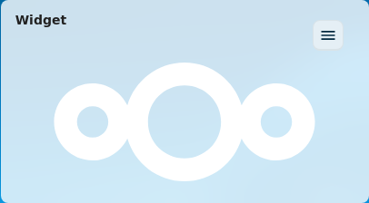

---

## link

A single big call-to-action button. The `displayMode='button'` legacy mode draws one button; `displayMode='list'` toggles the alternate mode where `links[]` is rendered inline.

**Renderer**: [`LinkButtonWidget.vue`](../../src/components/Widgets/Renderers/LinkButtonWidget.vue) · **Form**: [`LinkButtonForm.vue`](../../src/components/Widgets/Forms/LinkButtonForm.vue) · **Spec**: `openspec/specs/link-button-widget/spec.md`

| Field | Default | Notes |
|---|---|---|
| `label` | `''` | Button text. |
| `url` | `''` | Destination. |
| `icon` | `''` | Material Design icon name. |
| `actionType` | `external` | `external` / `internal`. |
| `backgroundColor` / `textColor` | `''` / `''` | |
| `displayMode` | `button` | `button` / `list`. |
| `listOrientation` / `listItemGap` | `vertical` / `normal` | List-mode only. |
| `links[]` | `[]` | List-mode children. |

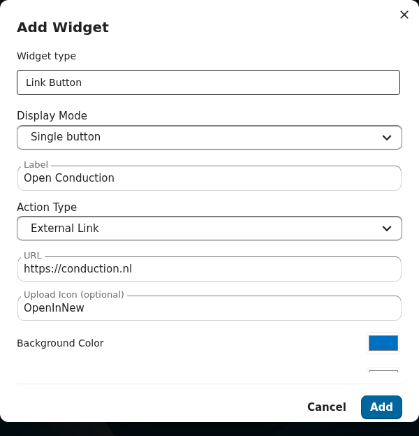
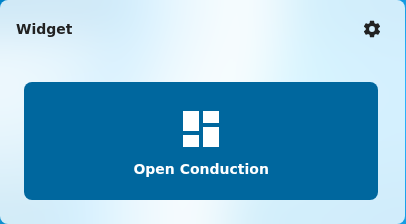

---

## nc-widget

A proxy that mounts any Nextcloud Dashboard API widget inside a MyDash placement. Use it to drop the standard "Upcoming events", "Important mail", "Favorites", etc. widgets onto a MyDash dashboard.

**Renderer**: [`NcDashboardWidget.vue`](../../src/components/Widgets/Renderers/NcDashboardWidget.vue) · **Form**: [`NcDashboardForm.vue`](../../src/components/Widgets/Forms/NcDashboardForm.vue) · **Spec**: `openspec/changes/nc-dashboard-widget-proxy/`

| Field | Default | Notes |
|---|---|---|
| `widgetId` | `''` | Nextcloud Dashboard widget id (e.g. `calendar`, `mail`). |
| `displayMode` | `vertical` | `vertical` / `horizontal`. |

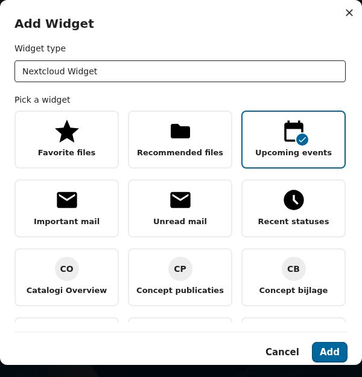
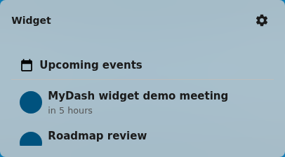

---

## header

A hero banner with optional background image, overlay, vertical/horizontal alignment, and a Call-to-Action button. The form's `validate()` requires a non-empty `title`, `http(s)` for any background URL, and CTA label/url paired (both or neither).

**Renderer**: [`HeaderWidget.vue`](../../src/components/Widgets/Renderers/HeaderWidget.vue) · **Form**: [`HeaderForm.vue`](../../src/components/Widgets/Forms/HeaderForm.vue) · **Spec**: `openspec/specs/header-banner-widget/spec.md`

| Field | Default | Notes |
|---|---|---|
| `title` | `''` | **Required**. |
| `subtitle` | `''` | |
| `backgroundImageUrl` | `''` | Must be `http(s)` if set. |
| `backgroundImageFileId` | `null` | Files-picker source. |
| `backgroundColor` | `''` | |
| `overlayMode` | `none` | `none` / `solid` / `gradient`. |
| `overlayColor` / `overlayOpacity` | `''` / `0.4` | |
| `textColor` | `''` | |
| `textAlign` / `verticalAlign` | `center` / `middle` | |
| `height` | `medium` | `small` / `medium` / `large`. |
| `cta` | `null` | `{label, url, icon}` or null. |

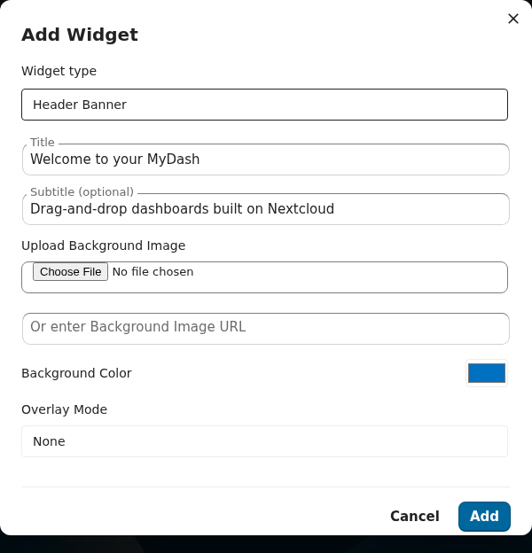
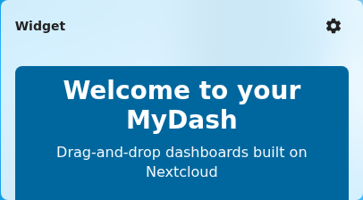

---

## divider

A visual separator between sections. Three styles:
- `line` — horizontal line with optional thickness/color/style
- `heading-break` — line + heading text (heading is required for this style)
- `whitespace` — pure spacing, no visible line

**Renderer**: [`DividerWidget.vue`](../../src/components/Widgets/Renderers/DividerWidget.vue) · **Form**: [`DividerForm.vue`](../../src/components/Widgets/Forms/DividerForm.vue) · **Spec**: `openspec/specs/divider-widget/spec.md`

| Field | Default | Notes |
|---|---|---|
| `style` | `line` | `line` / `heading-break` / `whitespace`. |
| `lineColor` / `lineThickness` / `lineStyle` | `''` / `1` / `solid` | |
| `whitespaceSize` | `medium` | `small` / `medium` / `large`. |
| `headingText` | `''` | **Required** for `heading-break`. |

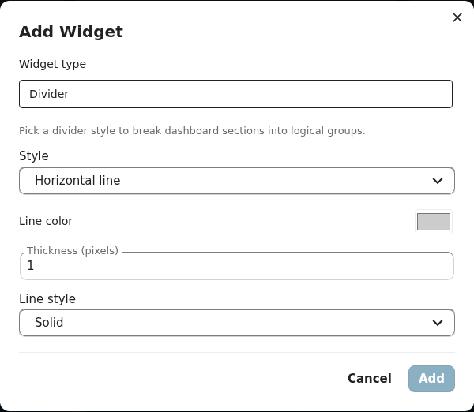
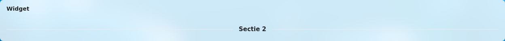

---

## files

Inline Files browser pinned to a folder or single file. Supports search, sort, optional upload/delete, and a mime-type filter.

**Renderer**: [`FilesWidget.vue`](../../src/components/Widgets/Renderers/FilesWidget.vue) · **Form**: [`FilesForm.vue`](../../src/components/Widgets/Forms/FilesForm.vue) · **Spec**: `openspec/specs/files-widget/spec.md`

| Field | Default | Notes |
|---|---|---|
| `folderPath` | `''` | Absolute Files path. Empty = error placeholder. |
| `fileId` | `null` | Pin a single file instead of a folder. |
| `viewMode` | `list` | `list` / `grid`. |
| `showThumbnails` | `true` | |
| `mimeTypeFilter[]` | `[]` | e.g. `['image/*']`. |
| `allowUpload` / `allowDelete` | `false` / `false` | |
| `sortBy` / `sortDescending` | `name` / `false` | |

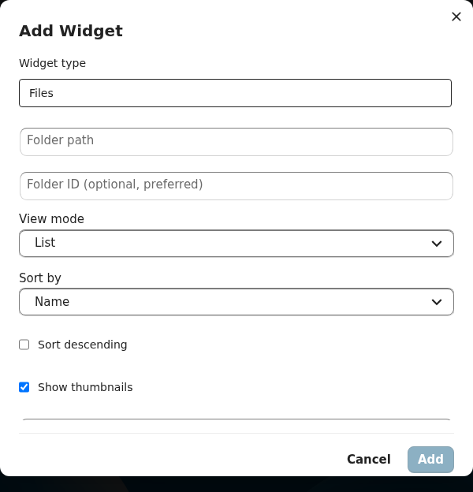
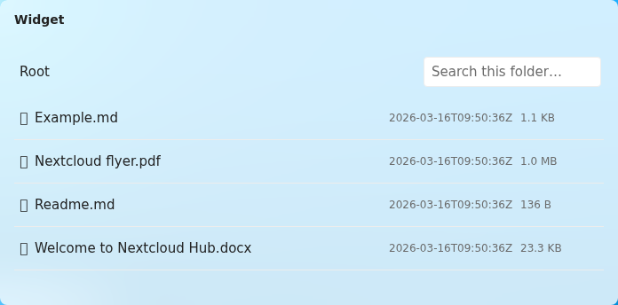

---

## people

Roster of users with two selection modes (`filter` for rule-based, `manual` for hand-picked), per-field display toggles, and a birthday window.

**Renderer**: [`PeopleWidget.vue`](../../src/components/Widgets/Renderers/PeopleWidget.vue) · **Form**: [`PeopleForm.vue`](../../src/components/Widgets/Forms/PeopleForm.vue) · **Spec**: `openspec/specs/people-widget/spec.md`

| Field | Default | Notes |
|---|---|---|
| `layout` | `grid` | `grid` / `list`. |
| `selectionMode` | `filter` | `filter` / `manual`. |
| `selectedUsers[]` | `[]` | Manual mode. |
| `filters[]` / `filterOperator` | `[]` / `AND` | Filter mode. |
| `excludeDisabled` | `true` | |
| `showBirthdays` / `birthdayWindowDays` | `true` / `7` | |
| `sortBy` / `columns` | `displayName` / `3` | |
| `showFields` | `{displayName, role, organisation, email, phone, avatar, birthdate}` | All `true` by default. |

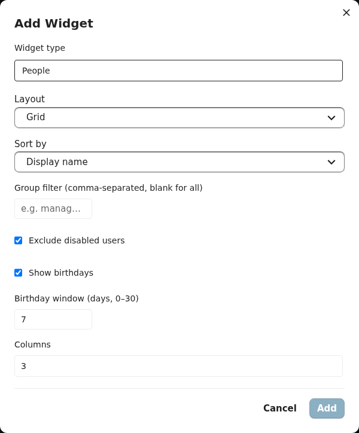
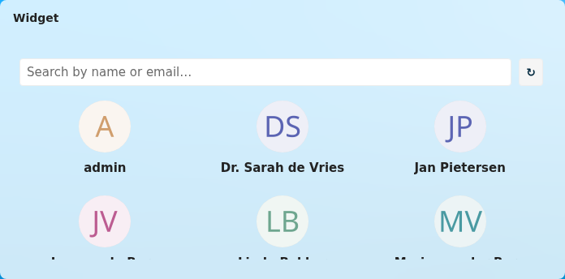

---

## quicklinks

A tile grid of favourite links — each with its own icon, label, and color. Useful for a "starter row" or as a compact navigation cluster.

**Renderer**: [`QuicklinksWidget.vue`](../../src/components/Widgets/Renderers/QuicklinksWidget.vue) · **Form**: [`QuicklinksForm.vue`](../../src/components/Widgets/Forms/QuicklinksForm.vue) · **Spec**: `openspec/specs/quicklinks-widget/spec.md`

| Field | Default | Notes |
|---|---|---|
| `links[]` | `[]` | `{id, label, url, icon, backgroundColor, textColor}`. |
| `iconSize` | `medium` | `small` / `medium` / `large`. |
| `iconShape` | `rounded` | `rounded` / `circle` / `square`. |
| `showLabels` / `labelPosition` | `true` / `below` | `below` / `overlay` / `right`. |
| `columns` | `auto` | Number or `auto`. |
| `tileBackgroundStyle` | `transparent` | `transparent` / `solid` / `outlined`. |
| `hoverEffect` | `lift` | `lift` / `fade` / `none`. |

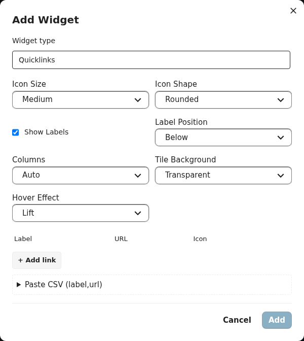
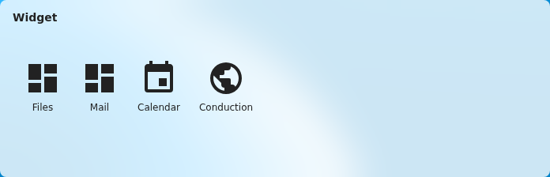

---

## news

Aggregated RSS / Atom feeds. The renderer fetches via the backend (`/api/widgets/news/{placementId}/items`) so CSP and CORS aren't issues.

**Renderer**: [`NewsWidget.vue`](../../src/components/Widgets/Renderers/NewsWidget.vue) · **Form**: [`NewsForm.vue`](../../src/components/Widgets/Forms/NewsForm.vue) · **Spec**: `openspec/specs/news-widget/spec.md`

| Field | Default | Notes |
|---|---|---|
| `feedUrls[]` | `[]` | One or many RSS/Atom URLs. |
| `layout` | `list` | `list` / `cards`. |
| `itemLimit` | `10` | |
| `showThumbnails` | `true` | |
| `showSummary` / `summaryMaxChars` | `true` / `200` | |
| `dateFormat` | `relative` | `relative` / `absolute`. |
| `metadataFilter` | `null` | Optional regex / category filter. |

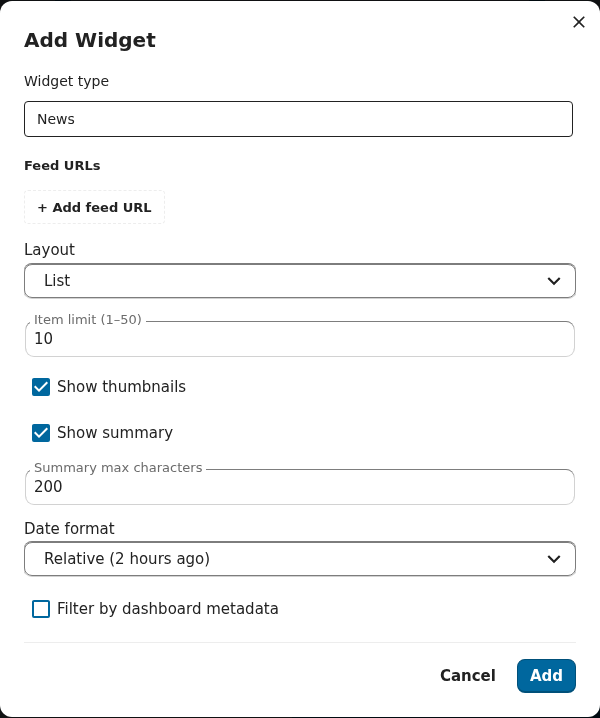
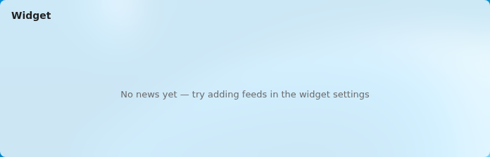

---

## video

Embedded video — either an external URL (mp4 / webm) or a Files-picker pin.

**Renderer**: [`VideoWidget.vue`](../../src/components/Widgets/Renderers/VideoWidget.vue) · **Form**: [`VideoForm.vue`](../../src/components/Widgets/Forms/VideoForm.vue) · **Spec**: `openspec/specs/video-widget/spec.md`

| Field | Default | Notes |
|---|---|---|
| `sourceType` | `null` | `url` / `file`. |
| `videoUrl` | `''` | Used when `sourceType='url'`. |
| `fileId` | `null` | Used when `sourceType='file'`. |
| `autoplay` / `muted` / `loop` / `controls` | `false` / `true` / `false` / `true` | |
| `aspectRatio` | `16:9` | `16:9` / `4:3` / `1:1`. |
| `posterUrl` | `''` | Optional thumbnail. |

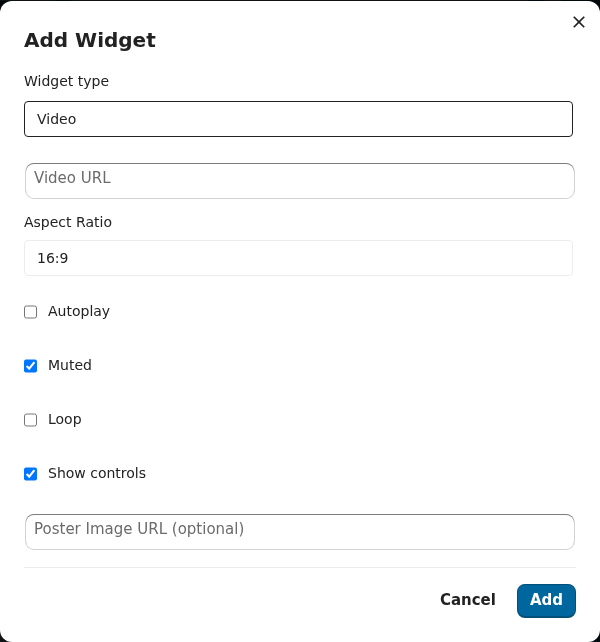
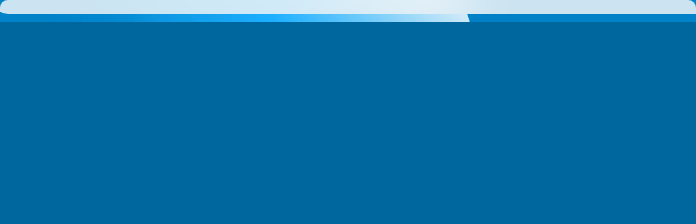

---

## calendar

Agenda of upcoming events. Pulls from selected internal Nextcloud calendars and any number of external ICS feeds.

**Renderer**: [`CalendarWidget.vue`](../../src/components/Widgets/Renderers/CalendarWidget.vue) · **Form**: [`CalendarForm.vue`](../../src/components/Widgets/Forms/CalendarForm.vue) · **Spec**: `openspec/specs/calendar-widget/spec.md`

| Field | Default | Notes |
|---|---|---|
| `internalCalendars[]` | `[]` | Calendar names from CalDAV. |
| `externalIcsUrls[]` | `[]` | Public ICS URLs. |
| `viewMode` | `agenda` | `agenda` / `month`. |
| `daysAhead` | `14` | Look-ahead window. |
| `colorByCalendar` | `true` | |

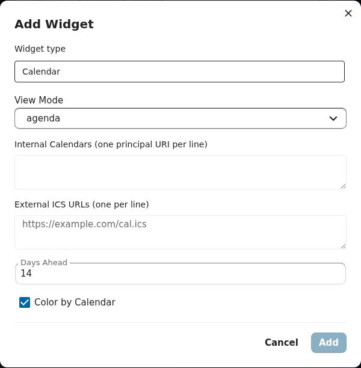
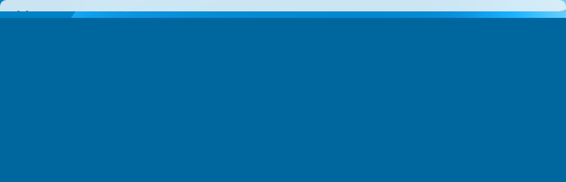

---

## links

A sectioned link directory — each section has a title and N links. Ideal for an intranet-style "useful links" panel.

**Renderer**: [`LinksWidget.vue`](../../src/components/Widgets/Renderers/LinksWidget.vue) · **Form**: [`LinksForm.vue`](../../src/components/Widgets/Forms/LinksForm.vue) · **Spec**: `openspec/specs/links-widget/spec.md`

| Field | Default | Notes |
|---|---|---|
| `sections[]` | `[]` | `{id, title, links: [{id, label, url, description, icon}]}`. |
| `columns` | `3` | |
| `linkLayout` | `card` | `card` / `inline`. |
| `iconSize` | `medium` | |
| `openInNewTab` | `true` | |
| `showSectionTitles` / `showLinkDescriptions` | `true` / `true` | |

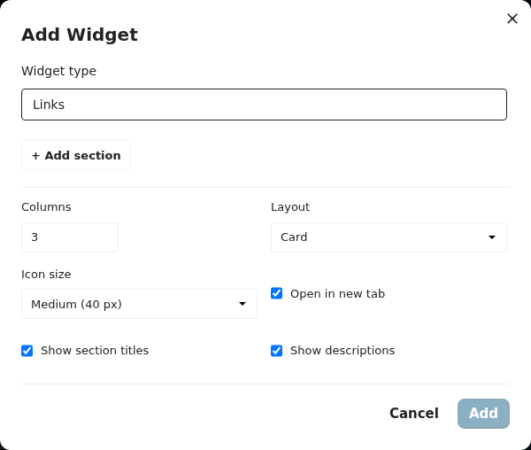

---

## menu

A navigation menu — dropdown or always-expanded, horizontal or vertical.

**Renderer**: [`MenuWidget.vue`](../../src/components/Widgets/Renderers/MenuWidget.vue) · **Form**: [`MenuForm.vue`](../../src/components/Widgets/Forms/MenuForm.vue) · **Spec**: `openspec/specs/menu-widget/spec.md`

| Field | Default | Notes |
|---|---|---|
| `items[]` | `[]` | `{id, label, url, icon, children?}`. |
| `style` | `dropdown` | `dropdown` / `expanded`. |
| `orientation` | `horizontal` | `horizontal` / `vertical`. |
| `showIcons` | `true` | |
| `expandedByDefault` | `false` | |
| `activeItemHighlight` | `underline` | `underline` / `background` / `none`. |

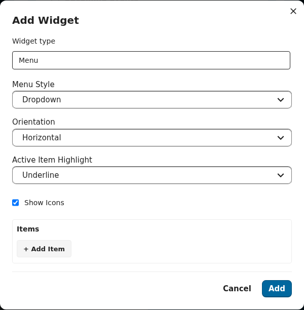

---

## container

A recursive sub-grid host. Children live in `content.placements[]` and render through the inner GridStack instance bounded by the container's outer cell. Server-side `REQ-CONT-006` caps recursion at 3 levels deep so a malformed payload can't blow up the renderer.

**Renderer**: [`ContainerWidget.vue`](../../src/components/Widgets/Renderers/ContainerWidget.vue) · **Form**: [`ContainerForm.vue`](../../src/components/Widgets/Forms/ContainerForm.vue) · **Spec**: `openspec/specs/container-widget/spec.md`

| Field | Default | Notes |
|---|---|---|
| `placements[]` | `[]` | Child placements (recursive — same shape as a top-level placement). |
| `backgroundColor` | `transparent` | |
| `padding` | `medium` | `none` / `small` / `medium` / `large`. |
| `title` | `''` | Optional section title. |

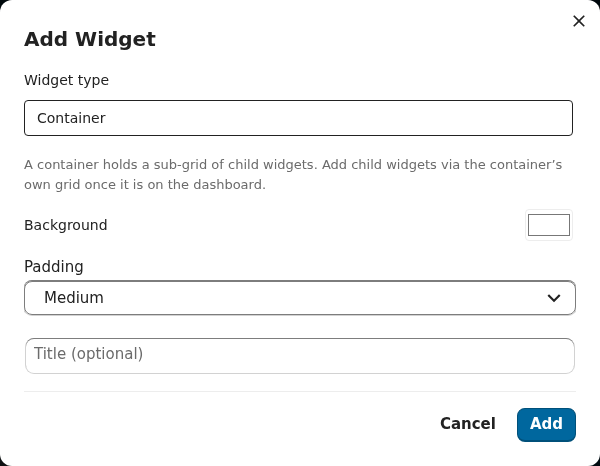

---

## tile

The registry-driven replacement for the deprecated standalone tile-creation flow. The renderer reads from BOTH the new inline `content.{...}` shape AND the legacy flat `placement.tile*` columns, so dashboards holding tile placements created via the deprecated `oc_mydash_tiles` flow keep rendering without a migration step.

**Renderer**: [`TileWidget.vue`](../../src/components/Widgets/Renderers/TileWidget.vue) · **Form**: [`TileForm.vue`](../../src/components/Widgets/Forms/TileForm.vue) · **Spec**: `openspec/specs/tiles/spec.md`

| Field | Default | Notes |
|---|---|---|
| `title` | `''` | Tile label. |
| `icon` | `''` | Material icon class or SVG path. |
| `iconType` | `class` | `class` / `svg`. |
| `backgroundColor` / `textColor` | `#3b82f6` / `#ffffff` | |
| `linkType` | `app` | `app` / `external` / `internal`. |
| `linkValue` | `''` | App id, URL, or internal route. |

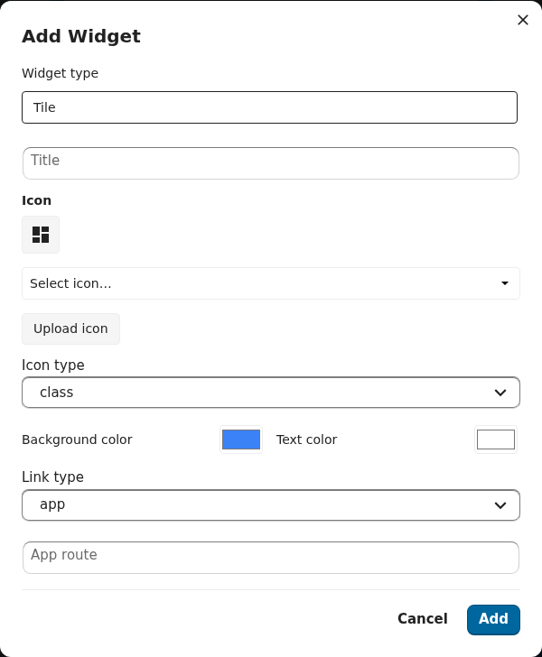

